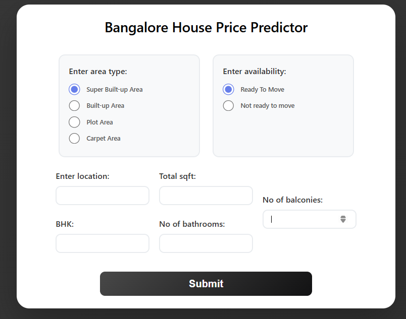
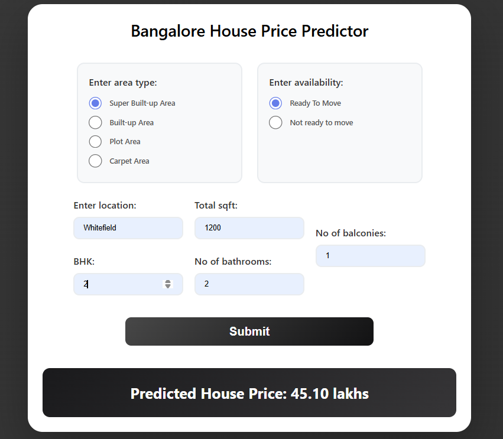
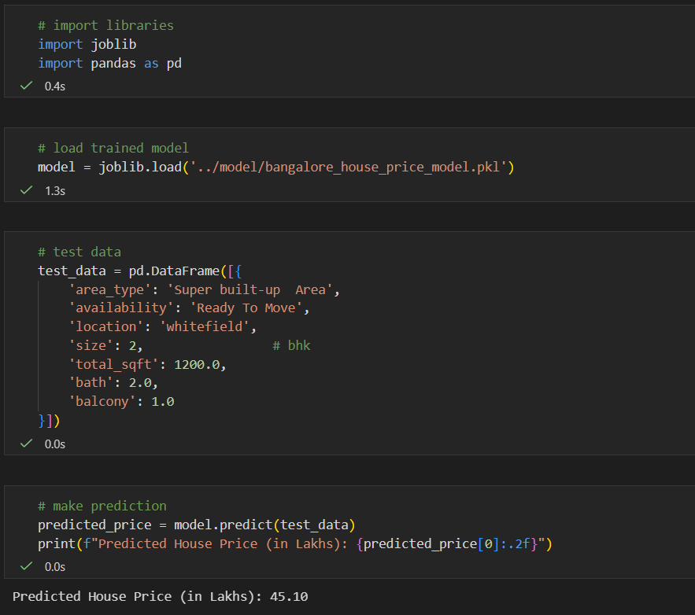

# Bangalore House Price Prediction 🏠

A machine learning project that predicts **house prices in Bangalore (in Lakhs)** using structured housing data.  
The project covers **data preprocessing, model training, evaluation, and deployment** using a Flask web app.





---

## Tech Stack

- Python
- Pandas, NumPy
- Scikit-learn
- Flask
- Matplotlib, Seaborn

---

## Project Structure

```
├── app/
│ ├── app.py
│ └── templates/
│    └── index.html
├── data/
│ └── banglore.csv
├── model/
│ ├── bangalore_house_price_model.pkl
│ └── loc_name.pkl
├── notebook/
│ ├── bang.ipynb
│ └── test.ipynb
├── src/
│ └── model.py
├── requirements.txt
├── output.png
├── output2.png
├── output3.png
└── README.md
```


---

## Data Preprocessing

- Filled missing values (`location`, `total_sqft`, `bath`, `balcony`)
- Converted `size` (e.g. `"2 BHK"` → `2`)
- Simplified `availability` to *Ready To Move / Not ready*
- Converted `total_sqft` ranges to numeric values
- Grouped rare locations (≤10 occurrences) as `other`
- Removed outliers using:
  - Price per sqft (3rd–97th percentile)
  - Minimum 250 sqft per BHK

---

## Model Training

- Models tested: **Linear Regression**, **Random Forest**
- Evaluation metric: **Mean Absolute Error (MAE)**
- Final model: **Random Forest Regressor**
- Approx. MAE: **~22–23 Lakhs**

- Random Forest was chosen because it:
  Achieved lower MAE
  Handled non-linear relationships better
  Did not require feature scaling

A full **scikit-learn pipeline** is used with `OneHotEncoder(handle_unknown='ignore')` and saved using `joblib`.

---

## Web Application (Flask)

- Takes user input via HTML form
- Loads the trained pipeline
- Predicts house price in Lakhs
- Displays result on the same page

### Run Locally

```bash
pip install -r requirements.txt
cd app
python app.py
Open: http://127.0.0.1:5000/


